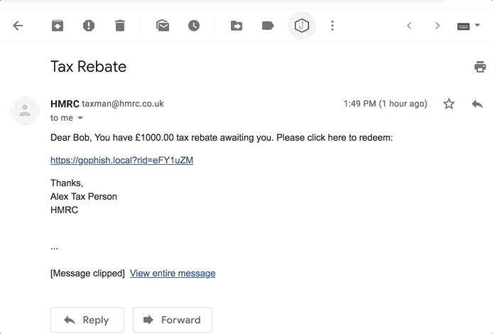
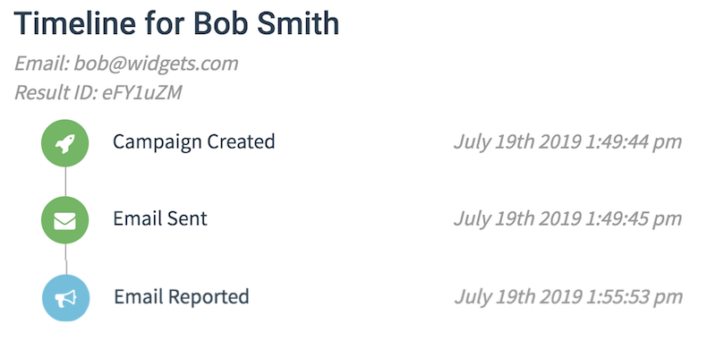

# GoPhish Reporter

A Chrome browser extension to allow reporting of GoPhish campaign emails and phishing emails from other sources.

## Installation

Browse to the [Chrome webstore](https://chrome.google.com/webstore/detail/gophish-email-reporter/jghcmmegcnpkmffjhdjofnfbpmokjlii) and install the extension.

Alternatively to run the extension locally follow the instructions below:

 * Download or clone this repository
 * Navigate to [chrome://extensions](chrome://extensions)
 * Expand the Developer dropdown menu and click "Load Unpacked Extension"
 * Navigate to the local folder containing the extension’s code and click OK

## Configuration

After installation the GoPhish logo should appear in the top right of your browser window. Click it to bring up the configuration window where you can enter your GoPhish endpoint.

Optionally, a company email address where non-GoPhish emails can be forwarded to.

If you skip the configuration the tool will prompt you when trying to report an email.

## Usage
Click the GoPhish icon in the GMail toolbar when viewing an email. If the email is indeed a GoPhish capaign the user will be congratulated:

If, however, the email is not a GoPhish campaign the user will be given the option to report the email to their IT department (as per the email address set in the confifguration).

(The actual outcome is that the email is automatically forwarded to the supplied email address)

For the first use case, the email should now be marked as reported in the GoPhish web interface:

## How it works

The extension scans the email body for an instance of `?rid=1234567`, which indicates the email is a GoPhish campaign (see the [GoPhish docs](https://docs.getgophish.com/user-guide/documentation/email-reporting)). The reporting endpoint will be:

`http://phish_server/report?rid=1234567`

Alas due to [CORS](https://en.wikipedia.org/wiki/Cross-origin_resource_sharing) we can't access this URL directly from our extension, so we 'relay' the request via an intermediary server:

`https://ruthere.herokuapp.com/j/http://myGohishServer.com/report?rid=1234567`
`https://ruthere.herokuapp.com/j/http://gophish.mooo.com/report?rid=eFY1uZM`

This endpoint will return the status code of the supplied URL, with `Access-Control-Allow-Origin: *` in the header (thanks for the help [@KentonVarda](https://twitter.com/KentonVarda)).

If the email is determined *not* to be from GoPhish, the user is prompted to send it to their IT department. This works by creating a new email and inserting the phishing email's HTML directly into it, and 'faking' a Forward header at the top from the other email attributes. This is done via [InboxSDK](https://www.inboxsdk.com/).

The settings between the Configuration popup and the GMail page are saved and shared with HTML5's `localstorage`.

## Built With

* [InboxSDK](https://www.inboxsdk.com/) - High level Javascript library for building extensions
* [GMail.js](https://github.com/KartikTalwar/gmail.js/tree/master) - Library for creating WebExtension-based browser-extensions    
* [jQuery](https://jquery.com/) - JavaScript library for HTML DOM tree traversal and manipulation
* [Heroku](https://www.heroku.com) - Cloud platform as a service
* [CloudFlare Workers](https://workers.dev/) - Deploying serverless code

## Notes

This is the first Chrome extension I've written, so there may be bugs or security risks. Please feel free to contribute fixes.

## License

This project is licensed under the MIT License - see the [LICENSE.md](LICENSE.md) file for details. 